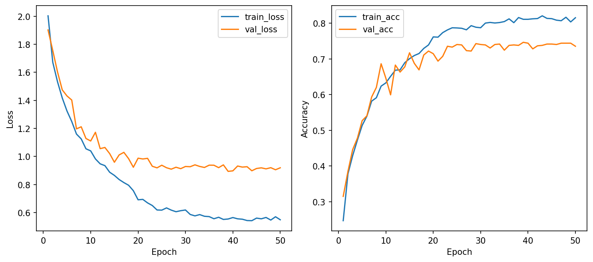
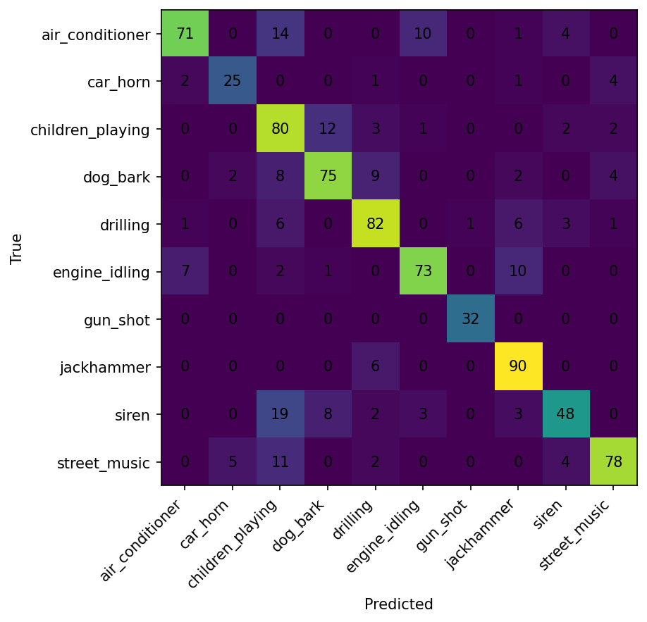

# CSC4005 Lab 4 Report – CRNN for UrbanSound8K

## 1. Thông tin sinh viên

- Họ tên: Lưu Thanh Tùng
- Mã sinh viên: 1771040029
- Lớp: KHMT-1701
- Link GitHub repo: https://github.com/FIT-DNU-CS-16-01/fit-dnu-cs-16-01-17-01-csc4005-csc4005_lab4-csc4005_lab4_urbansound8k_crnn_starter_kit
- Link W&B project: https://wandb.ai/thanhtung-contact-official-/csc4005-lab4-urbansound8k-crnn

## 2. Mục tiêu thí nghiệm

Mục tiêu của Lab 4 là xây dựng mô hình CRNN để phân loại 10 lớp âm thanh môi trường trong UrbanSound8K từ biểu diễn log-mel spectrogram. So với Lab 3 (1D-CNN), CRNN kết hợp hai phần: CNN để học mẫu cục bộ trên bản đồ thời gian-tần số và RNN để học diễn biến theo thời gian của chuỗi đặc trưng. Ngoài độ chính xác, thí nghiệm đánh giá thêm độ ổn định qua learning curves, ma trận nhầm lẫn và tốc độ huấn luyện.

## 3. Cấu hình dữ liệu

| Thành phần | Giá trị |
|---|---|
| Dataset | UrbanSound8K |
| Số lớp | 10 |
| Train folds | 1–8 |
| Validation fold | 9 |
| Test fold | 10 |
| Feature | log-mel spectrogram |
| Sampling rate | 16 kHz |
| Duration | 4 giây |
| Input tensor | [B, 1, 64, 126] |

## 4. Cấu hình mô hình

| Thành phần | Giá trị |
|---|---|
| Model | crnn_small |
| CNN blocks | 3 block Conv-BN-ReLU-MaxPool (channels: 16, 32, 64) |
| RNN type | GRU (baseline), 1 layer |
| Hidden size | 96 |
| Dropout | 0.3 |
| Optimizer | AdamW |
| Learning rate | 0.001 (giảm bằng ReduceLROnPlateau) |
| Batch size | 32 |
| Epochs | 50 |
| Patience | 50 |
| Trainable params | 71,338 |

## 5. Kết quả huấn luyện

Nguồn số liệu: `outputs/logmel_crnn_gru_baseline_e50_gpu/metrics.json`, `outputs/logmel_crnn_bilstm_extension_e50_gpu/metrics.json` và W&B.

| Run | best_val_acc | test_acc | trainable_params | avg_epoch_time_sec | Ghi chú |
|---|---:|---:|---:|---:|---|
| logmel_crnn_gru_baseline_e50_gpu | 0.7463 | 0.7814 | 71,338 | 83.59 | Run chính (GRU 1 chiều, hidden=96, lr=1e-3, dropout=0.3) |
| logmel_crnn_bilstm_extension_e50_gpu | 0.7218 | 0.7228 | 150,250 | 81.49 | Run mở rộng (BiLSTM, hidden=96, lr=7e-4, dropout=0.35) |

Chỉ số bổ sung:

- Baseline GRU: best_val_loss = 0.8938, test_loss = 0.6794.
- Extension BiLSTM: best_val_loss = 0.9829, test_loss = 0.7795.
- Cả hai run đều chạy đủ 50/50 epochs trên GPU và được log lên W&B.

## 6. Learning curves

Hình kết quả:

Nhận xét:

- train_loss giảm đều từ khoảng 2.00 xuống vùng 0.55, cho thấy mô hình học được đặc trưng.
- val_loss giảm mạnh giai đoạn đầu và hội tụ quanh 0.89–0.94 từ nửa sau huấn luyện.
- Có dấu hiệu overfitting nhẹ sau khoảng epoch 30 (train tiếp tục cải thiện nhưng val dao động), nhưng không nghiêm trọng.
- Do đặt patience = 50 và epochs = 50, run đã đi đủ số epoch theo yêu cầu thay vì dừng sớm.

## 7. Confusion matrix

Hình kết quả:

Nhận xét:

- Lớp phân loại tốt: gun_shot (recall = 1.00), jackhammer (recall = 0.9375), street_music (f1 = 0.8254).
- Lớp dễ nhầm: siren (recall = 0.5783), children_playing (precision = 0.5714).
- Cặp nhầm đáng chú ý: siren -> children_playing, dog_bark -> children_playing, air_conditioner -> children_playing.
- Các lỗi trên hợp lý với bối cảnh đô thị vì nhiễu nền phức tạp và nhiều lớp có dải tần/biên độ chồng lấn.

## 8. So sánh với Lab 3 1D-CNN

Nguồn số liệu Lab 3: `outputs/1771040029_logmel_1dcnn/metrics.json` (run tốt nhất của Lab 3) và các run liên quan.

Bảng tổng hợp các run đại diện:

| Run | Feature | Model | best_val_acc | test_acc | trainable_params | avg_epoch_time_sec |
|---|---|---|---:|---:|---:|---:|
| Lab 3 baseline MFCC | MFCC | 1D-CNN | 0.5810 | 0.4688 | 137,930 | 7.13 |
| Lab 3 log-mel (best) | log-mel | 1D-CNN | 0.6177 | 0.5914 | 145,610 | 4.55 |
| Lab 3 raw waveform | raw | 1D-CNN | 0.5400 | 0.5871 | 129,450 | 9.30 |
| Lab 4 baseline (run chính) | log-mel | CRNN-GRU | 0.7463 | 0.7814 | 71,338 | 83.59 |

Bảng so sánh định tính:

| Tiêu chí | Lab 3: 1D-CNN (log-mel) | Lab 4: CRNN-GRU (log-mel) |
|---|---|---|
| Feature chính | log-mel | log-mel |
| Khả năng học pattern cục bộ | Có (CNN 1D trên trục thời gian) | Có (CNN 2D trên bản đồ thời gian–tần số) |
| Khả năng học quan hệ thời gian | Hạn chế | Tốt hơn nhờ GRU |
| best_val_acc | 0.6177 | 0.7463 |
| test_acc | 0.5914 | 0.7814 |
| Trainable params | 145,610 | 71,338 |
| avg_epoch_time_sec | 4.55 | 83.59 |
| Nhận xét | Train nhanh, ít overfit nhưng accuracy thấp hơn | Train chậm hơn nhiều, nhưng ít tham số và độ chính xác cao hơn rõ rệt |

Nhận xét nhanh:

- CRNN-GRU tăng test_acc khoảng +0.19 so với 1D-CNN log-mel tốt nhất, dùng ít hơn ~51% tham số.
- CRNN-BiLSTM (mở rộng) cũng vượt 1D-CNN log-mel (+0.13 test_acc) mặc dù dùng nhiều tham số hơn GRU.
- Đổi lại, mỗi epoch CRNN tốn hơn 1D-CNN log-mel khoảng 18 lần thời gian do thêm CNN 2D và RNN.
- Trên cùng feature log-mel và cùng học sinh, kết quả ủng hộ giả thuyết của Lab 4: mô hình hoá thời gian bằng RNN giúp ích cho phân loại âm thanh môi trường.

## 8b. So sánh nội bộ hai run CRNN

| Tiêu chí | Baseline GRU | Extension BiLSTM |
|---|---:|---:|
| rnn_type | GRU 1 chiều | LSTM 2 chiều |
| hidden_size | 96 | 96 |
| lr | 1e-3 | 7e-4 |
| dropout | 0.30 | 0.35 |
| trainable_params | 71,338 | 150,250 |
| best_val_acc | 0.7463 | 0.7218 |
| best_val_loss | 0.8938 | 0.9829 |
| test_acc | 0.7814 | 0.7228 |
| test_loss | 0.6794 | 0.7795 |
| avg_epoch_time_sec | 83.59 | 81.49 |

Nhận xét:

- Trái với kỳ vọng "BiLSTM sẽ tốt hơn GRU", cấu hình mở rộng bị thấp hơn baseline khoảng 5.9 điểm test_acc dù gấp đôi tham số.
- Nguyên nhân có thể: (i) mô hình nhiều tham số hơn cần nhiều dữ liệu/epoch hơn để hội tụ, (ii) lr=7e-4 + dropout=0.35 khả năng cao là quy chính mạnh khiến underfit nhẹ, (iii) trên fold 10 cụ thể, hướng ngược của BiLSTM không bù được chi phí dung lượng tham số tăng.
- Kết quả cho thấy cần thử cross-validate qua nhiều fold hoặc tăng số epoch / giảm regularization trước khi kết luận BiLSTM kém hơn GRU.

## 9. Kết luận

Baseline CRNN-GRU với log-mel đã huấn luyện đủ 50 epochs trên GPU và đạt test accuracy 0.7814, cao hơn run tốt nhất của Lab 3 (1D-CNN log-mel, test 0.5914) khoảng 19 điểm phần trăm dù chỉ dùng ~71 nghìn tham số so với ~146 nghìn ở Lab 3. Run mở rộng CRNN-BiLSTM cũng đã hoàn tất 50 epochs và đạt test accuracy 0.7228, tốt hơn 1D-CNN nhưng kém baseline GRU, cho thấy dung lượng mô hình lớn hơn cần được cân bằng với lr và dropout phù hợp. Learning curves cho thấy cả hai mô hình hội tụ tốt, có overfitting nhẹ ở giai đoạn cuối nhưng chưa gây suy giảm mạnh trên test fold 10. Confusion matrix cho thấy các lớp cơ học mạnh như gun_shot và jackhammer phân biệt tốt, trong khi siren và children_playing vẫn còn khó với cả hai run. Đổi lại, thời gian huấn luyện mỗi epoch của CRNN dài hơn 1D-CNN khoảng 18 lần, nên cần cân nhắc giữa độ chính xác và chi phí. Hướng tiếp theo: tinh chỉnh lr/dropout cho BiLSTM, tăng số epoch hoặc dùng k-fold CV để đánh giá công bằng hơn, và mạnh tay hơn với augmentation cho các lớp dễ nhầm (siren, children_playing).

## 10. Link minh chứng

- GitHub commit cuối: cập nhật sau khi push commit mới
- W&B run debug: https://wandb.ai/thanhtung-contact-official-/csc4005-lab4-urbansound8k-crnn/runs/cj951u5k
- W&B run baseline GRU: https://wandb.ai/thanhtung-contact-official-/csc4005-lab4-urbansound8k-crnn/runs/cfccch9h
- W&B run extension BiLSTM: https://wandb.ai/thanhtung-contact-official-/csc4005-lab4-urbansound8k-crnn/runs/rcsrrb3x
